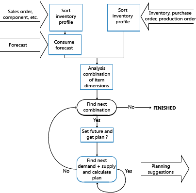

# Design Details: The Concept of Balancing in Brief
Demand is given by a company’s customers. Supply is what the company can create and remove to establish balance. The planning system starts with the independent demand and then tracks backwards to the supply.  
  
 The inventory profiles are used to contain information about the demands and supplies, quantities, and timing. These profiles essentially make up the two sides of the balancing scale.  
  
 The objective of the planning mechanism is to counterbalance the demand and supply of an item to ensure that supply will match demand in a feasible way as defined by the planning parameters and rules.  
  
   
  
## See Also  
 [Design Details: Balancing Demand and Supply](design-details-balancing-demand-and-supply.md)   
 [Design Details: Central Concepts of the Planning System](design-details-central-concepts-of-the-planning-system.md)   
 [Design Details: Supply Planning](design-details-supply-planning.md)